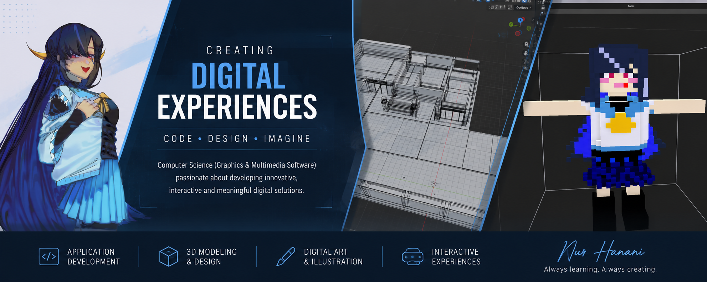
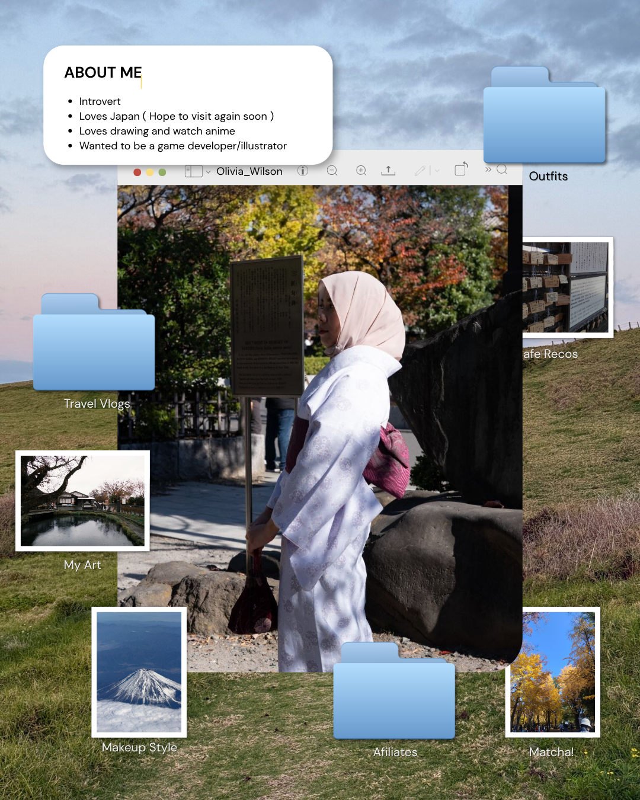
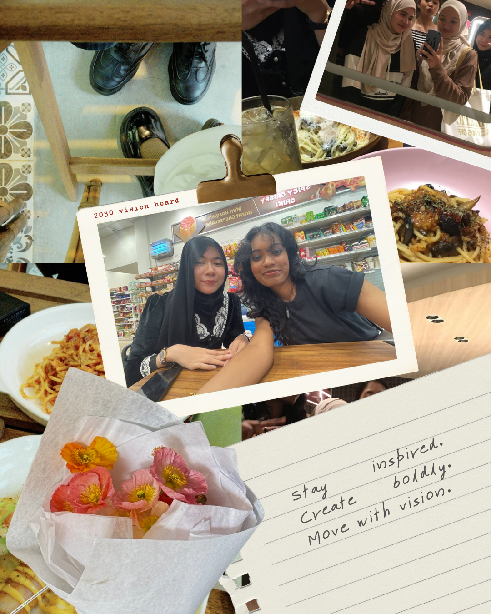
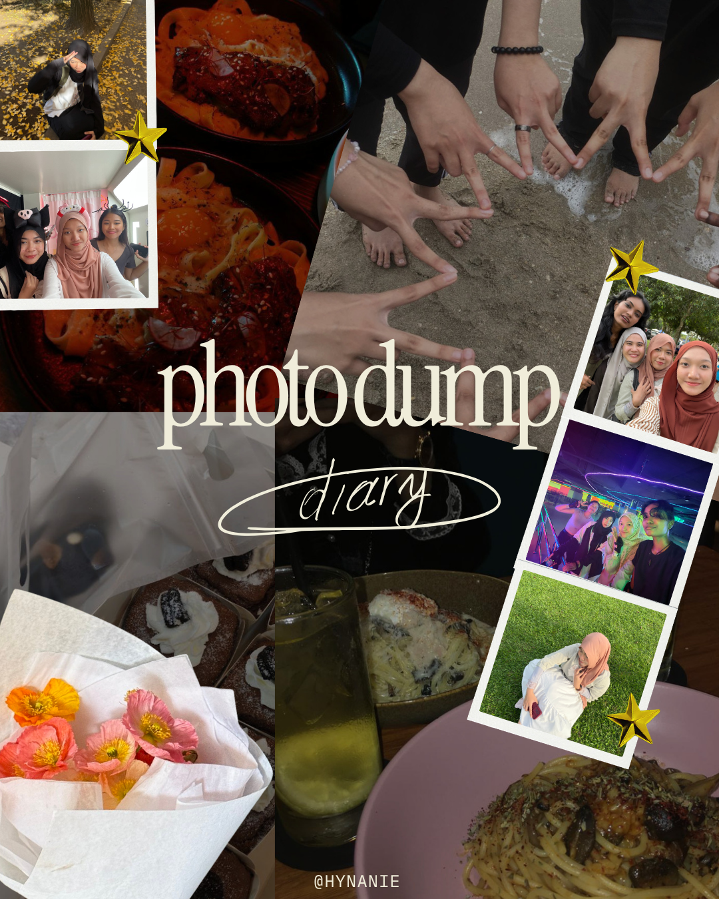

  

<h1 align="center"> Nur Hanani Binti Ahmad</h1>
<h3 align="center">Final-Year Computer Science (Graphics & Multimedia Software) Student</h3>

Game and XR developer focused on Unity, VR/AR, and AI-integrated interactive systems

<a href="https://hynanie.github.io/Portfolio_websitee/">🌐 Portfolio</a> ·
<a href="https://www.linkedin.com/in/nur-hanani-binti-ahmad-b636333a3/">💼 LinkedIn</a> ·
<a href="mailto:hynanie04@gmail.com">📧 Email</a>

 

  

## 🙋‍♀️ About

- 🎓 Final-year student, Bachelor of Computer Science (Graphics & Multimedia Software), Universiti Teknologi Malaysia
- 🛠️ Building game systems, VR/AR applications, and AI-integrated tools
- 🎨 Loves drawing, anime, and all things Japan
- 🌱 Always learning. Always creating.

 

## 🧰 Tech Stack

| Category | Tools |
|---|---|
| 💻 Languages | C++, Python, Java, JavaScript, HTML, CSS, PHP |
| 🎮 Game Engines & XR | Unity, Unreal Engine, Blender |
| 🤖 AI / ML & Frameworks | TensorFlow/Keras, OpenCV, Flutter, React |
| 🎨 Design & Tools | Figma, Adobe Illustrator, Photoshop, Git |

 

## 🚀 Featured Projects

> Repo links added as each project is pushed public.

| Project | Description | Tech |
|---|---|---|
| **[SignBridge](https://github.com/Hynanie/SignBridge)** 🥇 | Real-time BIM sign language interpreter app. Gesture-to-text via camera AI and text-to-3D animated signing avatar. Gold Medal, I3DC 2026. | Flutter, TensorFlow/Keras, AI Gesture Recognition |
| **[Arked Meranti — 3D Campus Tour](https://github.com/Hynanie/MWP3DModel)** 👥 | Interactive browser-based 3D tour of UTM's Arked Meranti food court, with day/night lighting and first-person walk mode. My role: 3D Blender model, on-site reference research. | Three.js, Blender, Vercel |
| **Hover Menu UI (Leap Motion + AR)** 🔒👥 | Gesture-controlled hover menu for handheld AR — flip-palm activation, finger gestures to spawn/resize objects, synced via Photon Networking to a Vuforia AR app. [Demo video](https://youtu.be/b-dJ7OgymLs). | Unity, Leap Motion, Photon Networking, Vuforia |
| **[DiaLink](https://github.com/Hynanie/dialink)** 👥 | Club management web app for UTM Diabolo Club — member management, attendance tracking, and automated notifications. | HTML, CSS, PHP, JavaScript, Figma |

 

## 📂 Repositories

**⭐ Featured**

| Repo | Description |
|---|---|
| [SignBridge](https://github.com/Hynanie/SignBridge) | Real-time BIM sign language interpreter app — Gold Medal, I3DC 2026 |
| [MWP3DModel](https://github.com/Hynanie/MWP3DModel) (forked, team project) | Arked Meranti interactive 3D campus tour — Three.js |
| [dialink](https://github.com/Hynanie/dialink) (forked, team project) | Club management web app for UTM Diabolo Club |
| SpawnObject (private, team project) | Hover Menu UI using Leap Motion in Handheld AR — [demo video](https://youtu.be/b-dJ7OgymLs) |

**🌐 Portfolio & Web**

| Repo | Description |
|---|---|
| [Portfolio_websitee](https://github.com/Hynanie/Portfolio_websitee) | Live portfolio site, hosted on GitHub Pages |

**📚 Coursework & Assignments**

| Repo | Description |
|---|---|
| [CandyCane_Project1_SAD_20232024](https://github.com/Hynanie/CandyCane_Project1_SAD_20232024) | System Analysis & Design course project |
| [ASSIGNMENT-4-DESIGN-THINKING](https://github.com/Hynanie/ASSIGNMENT-4-DESIGN-THINKING) | Design Thinking coursework |
| [ASSIGNMENT-3-VIDEO-ON-VISIT-TO-UTMDIGITAL-AND-THE-VIRTUAL-TALK](https://github.com/Hynanie/ASSIGNMENT-3-VIDEO-ON-VISIT-TO-UTMDIGITAL-AND-THE-VIRTUAL-TALK) | Coursework video assignment |
| [ASSIGNMENT-2-ICT-JOBS-IN-CLARITY-TECHWORK](https://github.com/Hynanie/ASSIGNMENT-2-ICT-JOBS-IN-CLARITY-TECHWORK) | Coursework report |
| [ASSIGNMENT-1-REPORT-VISIT-TO-NALI](https://github.com/Hynanie/ASSIGNMENT-1-REPORT-VISIT-TO-NALI) | Coursework visit report |
| [PC-ASSEMBLE](https://github.com/Hynanie/PC-ASSEMBLE) | PC assembly practical assignment |

 

## 📊 GitHub Stats

 

## 📸 Beyond the Code

<i>a little bit of life outside the editor ✨</i>
  

 

## 🔗 Connect

| | |
|---|---|
| 💼 LinkedIn | [nur-hanani-binti-ahmad](https://www.linkedin.com/in/nur-hanani-binti-ahmad-b636333a3/) |
| 📸 Instagram | [@hynanie](https://instagram.com/hynanie) |
| 📧 Email | hynanie04@gmail.com |

 

